# 👋 Welcome to my github !  

  

🚀 **Senior Full-Stack & AI Developer** with 7+ years of experience building cutting-edge solutions across web and AI decentralized applications.

## 🚀 About Me

I'm a passionate Full-Stack Developer with over 7 years of experience in building dynamic, user-friendly web applications. I specialize in React, Vue.js, Node.js, and Spring Boot, with proficiency in both front-end and back-end technologies. I excel in creating scalable, high-performance solutions using MongoDB, MySQL, and PostgreSQL. I’m committed to writing clean, maintainable code, optimizing performance, and delivering products that exceed expectations. Always eager to learn and collaborate to solve real-world challenges.

## 🎯 Bio

-   🏢 I'm currently working at **Bolstar**
-   ⚙️ I use daily: `.ts`, `.js`, `.java`
-   🌍 I'm mostly active within the **Javascript Community**
-   🌱 Learning all about **DevOps**
-   💬 Ping me about **React.js**, **Node.js**, **Express.js**, **Next.js**, **Nest.js**, **Spring Boot**, **RestAPIs**

## ⚡ My Skills
 

<table align="center">
  <tr>
      <td align="center" width="90">
        
         Javascript
      </td>
      <td align="center" width="90">
        
         Typescript
      </td>
      <td align="center" width="90">
        
         React
      </td>
      <td align="center" width="90">
        
         Next.js
      </td>
      <td align="center" width="90">
        
         Vue
      </td>
      <td align="center" width="90">
        
         Nuxt.js
      </td>
      <td align="center" width="90">
        
         Angular
      </td>
      <td align="center" width="90">
        
         Three.js
      </td>
    </tr>
    <tr>
        <td align="center" width="90">
          
             Rust
          </td>
        <td align="center" width="90">
          
           Python
        <td align="center" width="90">
            
             C#
        </td>
        <td align="center" width="90">
            
             Solidity
        </td>
        <td align="center" width="90">
            
             Go
        </td>
        <td align="center" width="90">
          
           Django
        </td>
        <td align="center" width="90">
          
           Laravel
        </td>
        <td align="center" width="90">
          
           WordPress
        </td>
    </tr>
</table>
<h2></h2>

## 🚀 Tech Stack & Badges

  
  
  
  
  
  
  
  
  
  
  
  
  

---

## 📈 My GitHub Activity

<!-- GitHub Readme Activity Graph -->

---

## 📊 Contribution and Language Stats

  
  

---

## 🗺️ Decorated Activity Line Chart

> **Development workflow illustrated at a glance!**

```mermaid
%% Modern, colored, emoji-enhanced line chart of dev workflow
%% Paste in mermaid.live for richer rendering!

%% This is a "journey" chart for beautiful lines, milestones, and coloring

journey
    title FullStackDeveloper: Project Life Cycle
    section Ideation
      Plan & Research  : 5: 👨‍💻
      Brainstorm Ideas : 4: 🧠
    section Design
      UX/UI Design     : 5: 🎨
      Prototype        : 4: 🛠
    section Implementation
      Frontend Dev     : 5: ⚛️
      Backend Dev      : 5: 🏗
      Integrate AI     : 4: 🤖
    section Verification
      Testing/QA       : 5: ✅
      Code Review      : 4: 👀
    section Deployment & Feedback
      CI/CD Deploy     : 5: 🚀
      Monitor & Alert  : 4: 📊
      Feedback Cycle   : 5: 🔁
```

---

